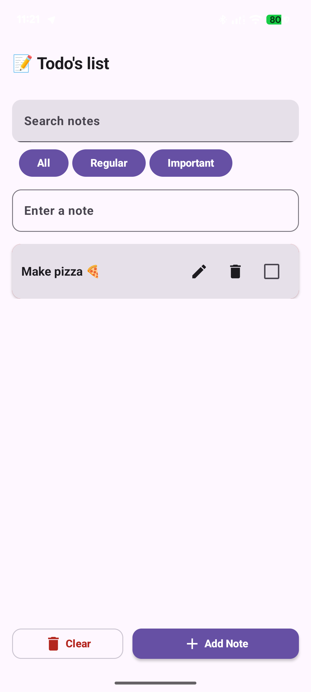
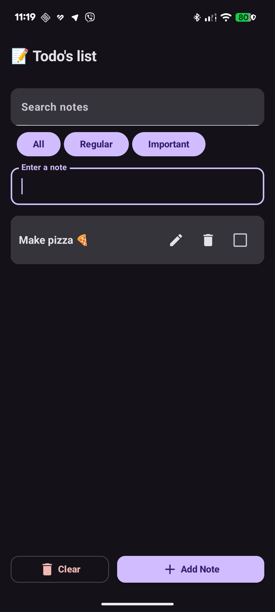
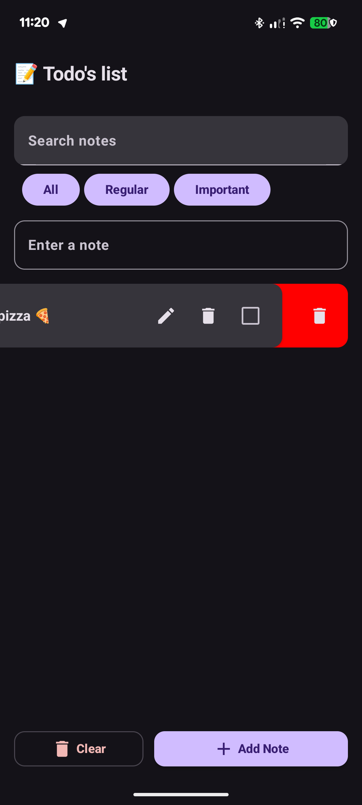

# 📝 SimpleNotes - Todo List

A modern, feature-rich Android application for managing daily tasks with an intuitive UI and powerful functionality. Built with **Jetpack Compose**, **Room Database**, and **MVVM** architecture.

---

## ✨ Features

### Core Functionality
- ✅ **Full CRUD Operations** - Create, read, update, and delete notes effortlessly
- 💾 **Local Persistence** - All data stored securely using Room Database (SQLite)
- 🔍 **Search Notes** - Real-time search by note title
- 🎯 **Priority Filtering** - Filter tasks by Regular, Important, or view All
- 📋 **Task Status** - Mark tasks as done/undone with checkboxes
- 🗑️ **Swipe to Delete** - Intuitive swipe-right gesture to remove notes
- 🎨 **Dark/Light Theme** - Automatic theme support following system preferences

### Advanced Features
- 📝 **Rich Note Details** - Add title, description, priority level, and reminders for each note
- ⏰ **Reminder System** - Set date and time reminders for important tasks
- 🎯 **Priority Levels** - Two priority levels: Regular and Important
- 🔄 **Real-time Updates** - Reactive UI with StateFlow and Coroutines
- 🎭 **Inline Editing** - Quick edit mode directly in the list
- 🧹 **Clear All** - One-click option to clear entire task list

---

## 🛠 Tech Stack

| Technology | Purpose |
|-----------|---------|
| **Kotlin** | Primary programming language |
| **Jetpack Compose** | Modern, reactive UI framework (Material 3) |
| **Room** | Local SQLite database with type safety |
| **ViewModel** | UI state management with lifecycle awareness |
| **StateFlow** | Reactive data streams |
| **Coroutines** | Asynchronous operations |
| **Material 3** | Modern Material Design components |

---

## 📱 Screenshots

### Light Theme
| Search & Filter | Detail Screen | Note Editing |
|:---:|:---:|:---:|
|  |  |  |

### Dark Theme
| Search & Filter | Swipe Delete | List View |
|:---:|:---:|:---:|
|  |  |  |

---

## 🏗️ Architecture

### MVVM Pattern
```
View (Composable) 
    ↓
ViewModel (State Management)
    ↓
Repository (Data Source)
    ↓
Room Database
```

### Key Components

**Data Layer**
- `Note.kt` - Entity class with all note properties
- `NoteDAO.kt` - Database queries (Insert, Update, Delete, Search)
- `NoteDatabase.kt` - Room database configuration

**UI Layer**
- `NoteScreen.kt` - Main composable with state management
- `NoteDetailActivity.kt` - Detail screen for editing notes
- Material 3 components (Card, TextField, Button, TopAppBar, etc.)

**Logic Layer**
- `NoteViewModel.kt` - Manages app state and user events
- `NoteEvent.kt` - User actions (SaveNote, DeleteNote, etc.)
- `NoteState.kt` - UI state representation

---

## 🎯 How to Use

### Adding a Note
1. Enter task title in "Enter a note" field
2. Click "Add Note" button
3. _(Optional)_ Click on the note card to add description, priority, and reminders

### Editing a Note
1. Click the note card to open detail screen
2. Modify title, description, priority, and set reminders
3. Click "Save" to persist changes

### Searching & Filtering
1. Type in "Search notes" field to filter by title
2. Click priority buttons: **All** | **Regular** | **Important**
3. Filters work together (e.g., search "pizza" with "Important" priority)

### Deleting Notes
- **Quick Delete:** Swipe note right to reveal red Delete box
- **Inline Delete:** Click trash icon in the note row
- **Clear All:** Click "Clear" button to delete entire list

### Task Completion
- Click checkbox to mark task as done/undone
- Visual feedback updates instantly

---

## 📋 Database Schema

### Notes Table
| Column | Type | Description |
|--------|------|-------------|
| `id` | INTEGER (PK) | Unique identifier, auto-generated |
| `title` | TEXT | Note title |
| `description` | TEXT | Detailed note content |
| `priority` | INTEGER | 0 = Regular, 1 = Important |
| `reminderTime` | LONG | Unix timestamp for reminder |
| `isDone` | BOOLEAN | Task completion status |
| `createdAt` | LONG | Creation timestamp |
| `updatedAt` | LONG | Last modification timestamp |

---

## 🚀 Getting Started

### Prerequisites
- Android Studio (latest version)
- Android SDK 24 or higher
- Kotlin 1.8+

### Installation
1. Clone the repository:
   ```bash
   git clone https://github.com/yourusername/SimpleNotes.git
   cd SimpleNotes
   ```

2. Open in Android Studio:
   ```bash
   android-studio .
   ```

3. Build and run:
   - Click "Run" or press `Shift + F10`
   - Select target device/emulator

### Project Structure
```
SimpleNotes/
├── app/
│   └── src/main/
│       ├── java/com/example/simplenotes/
│       │   ├── data/
│       │   │   ├── Note.kt
│       │   │   ├── NoteDAO.kt
│       │   │   └── NoteDatabase.kt
│       │   └── ui/
│       │       ├── NoteState.kt
│       │       ├── NoteEvent.kt
│       │       ├── MainActivity.kt
│       │       ├── NoteViewModel.kt
│       │       ├── NoteScreen.kt
│       │       ├── NoteDetailActivity.kt
│       │       └── theme/
│       └── res/
│           └── values/
├── build.gradle.kts
└── settings.gradle.kts
```

---

## 🔑 Key Implementation Details

### State Management
- Uses `MutableStateFlow` for reactive state
- `remember { mutableStateOf() }` for local UI state
- `LaunchedEffect` for one-time operations like loading data

### Search & Filter Logic
```kotlin
val filteredNotes = state.notes.filter { note ->
    note.title.contains(searchQuery, ignoreCase = true) &&
    (priorityFilter == "All" ||
     (priorityFilter == "Regular" && note.priority == 0) ||
     (priorityFilter == "Important" && note.priority == 1))
}
```

### Swipe to Delete
- Uses Material 3 `SwipeToDismissBox`
- Direction: Right-to-left (EndToStart)
- Instant deletion with smooth animation

---

## 📝 Future Enhancements

- [ ] Cloud backup with Firebase
- [ ] Task categories/tags
- [ ] Recurring reminders
- [ ] Note sharing
- [ ] Dark mode toggle
- [ ] Statistics dashboard
- [ ] Export to PDF/CSV

---

## 🤝 Contributing

Contributions are welcome! Feel free to submit issues and pull requests.

1. Fork the repository
2. Create a feature branch (`git checkout -b feature/AmazingFeature`)
3. Commit changes (`git commit -m 'Add AmazingFeature'`)
4. Push to branch (`git push origin feature/AmazingFeature`)
5. Open a Pull Request

---

## 👨‍💻 Author

**SimpleNotes** - A modern task management app built with Kotlin & Compose

---

## 🎓 Learning Resources

This project demonstrates:
- ✅ Jetpack Compose best practices
- ✅ MVVM architecture pattern
- ✅ Room database integration
- ✅ Kotlin coroutines and StateFlow
- ✅ Material 3 design system
- ✅ Responsive UI design

Perfect for learning modern Android development!

---

**Made with ❤️ using Kotlin & Jetpack Compose**
