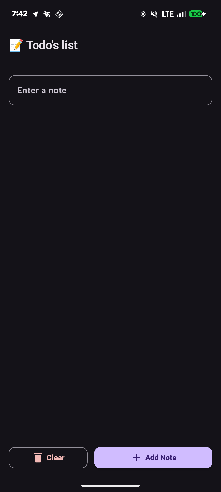
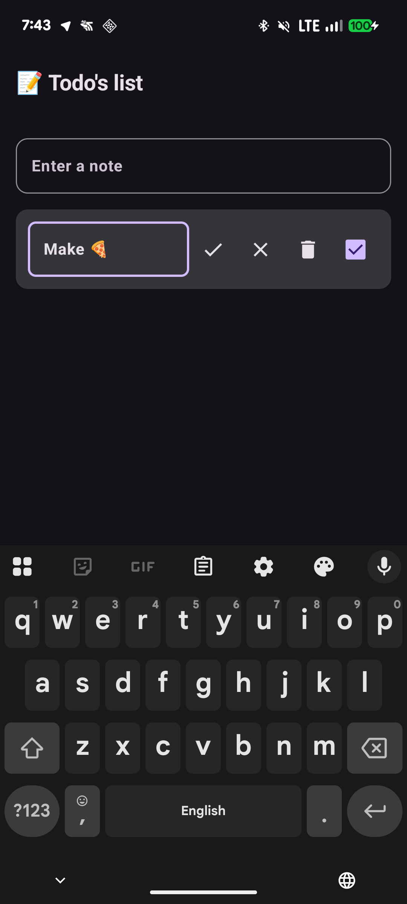

# 📝 Simple Notes (Todo List)

A modern, lightweight Android application for managing daily tasks. Built with **Jetpack Compose**, **Room Database**, and following **MVVM** architecture patterns.

## ✨ Features
- **Full CRUD:** Create, read, update, and delete notes.
- **Persistence:** All notes are stored locally using Room Database (SQLite).
- **Modern UI:** Material 3 design with rounded shapes, cards, and intuitive icons.
- **Dynamic Interface:** Seamlessly switch between viewing and editing modes.
- **Task Management:** Toggle task completion with a checkbox and clear the entire list with one click.

## 🛠 Tech Stack
- **Language:** Kotlin
- **UI Framework:** Jetpack Compose (Material 3)
- **Database:** Room Persistence Library
- **Architecture:** MVVM (Model-View-ViewModel)
- **Asynchronous Programming:** Kotlin Coroutines & StateFlow
- **Dependency Management:** Gradle (Kotlin DSL) with JVM Toolchain

## 📸 Screenshots
| Main List | Edit Mode |
|-----------|-----------|
|  |  |

## 🚀 How to Run
1. Clone the repository:
   ```bash
   git clone [https://github.com/Jolly-Bell/SimpleNotes.git](https://github.com/Jolly-Bell/SimpleNotes.git)
